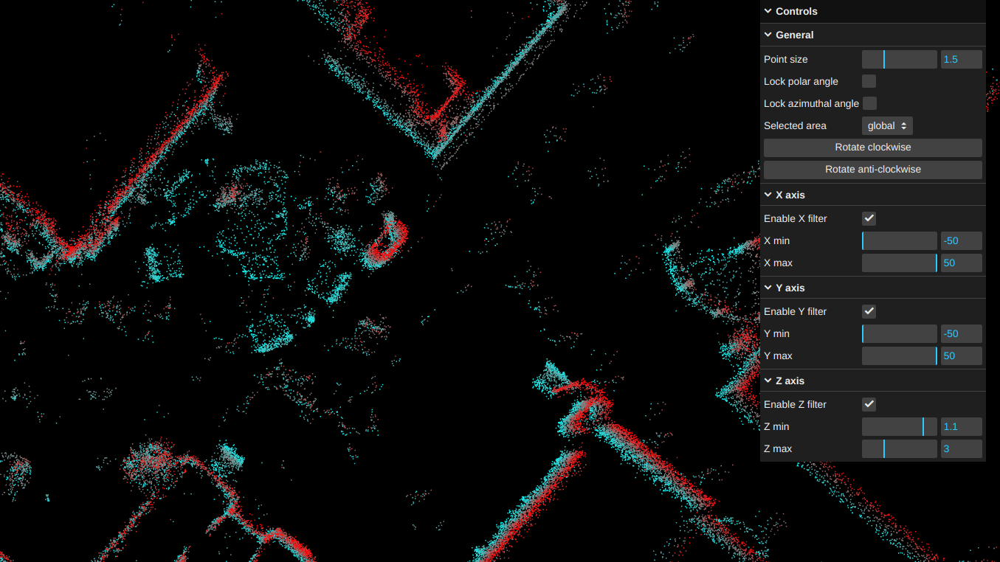

# PCD Viewer

Web app for visualizing and filtering PCD files in real-time. Uses Three.js, lil-gui, and shaders. Allows loading PCD files, changing point size, filtering based on XYZ axis, rotating, and locking polar/azimuthal angles.

_Quick showcase._

_Settings_

_Screenshot of the interface_

Created for my Master's Thesis: "Evaluating State-of-the-Art LiDAR SLAM in Challenging Indoor Environments with Glass and Specular Surfaces".
