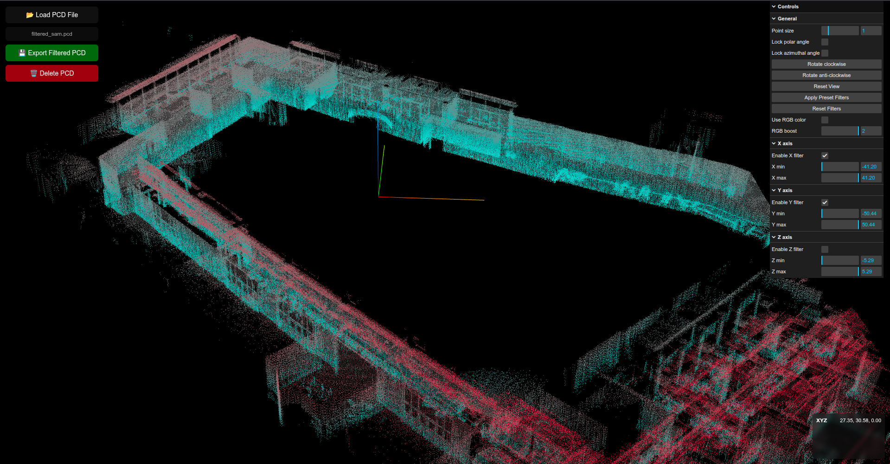

# PCD Tools

This project is a web interface for visualizing and processing point cloud data (PCD) locally.

## Features

- Load and visualize PCD files
- Adjust point size
- Filter based on XYZ axis
- Rotate visualization
- Lock polar/azimuthal angles
- Download processed PCD files

## Screenshots

<!-- Images will be added here -->



## Setup

1. Clone the repository:
   ```bash
   git clone https://github.com/alitekes1/pcd_tools.git
   ```
2. Navigate to the project directory:
   ```bash
   cd pcd_tools
   ```
3. Open the `index.html` file using a web server. For example, you can use Python's simple HTTP server:
   ```bash
   python -m http.server
   ```
   Then, go to `http://localhost:8000` in your browser.

## Usage

Once the application is loaded, you can load your PCD files and interact with the features mentioned above.

